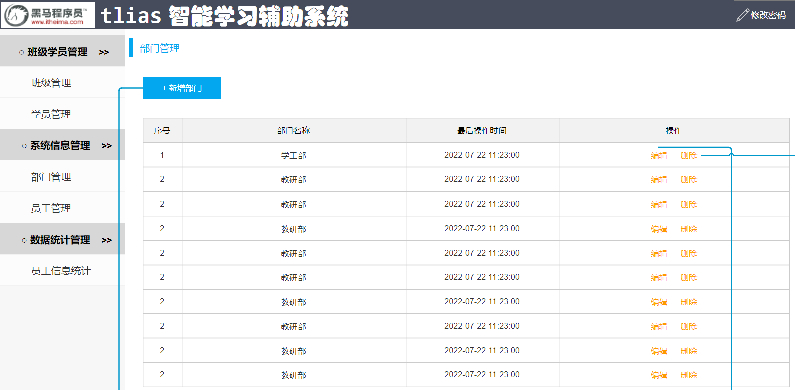
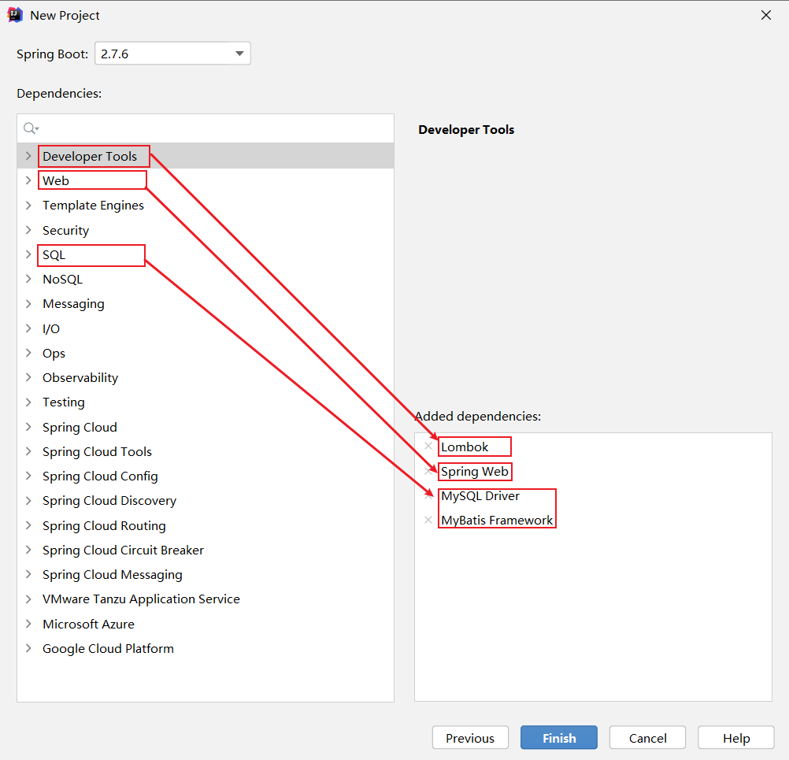
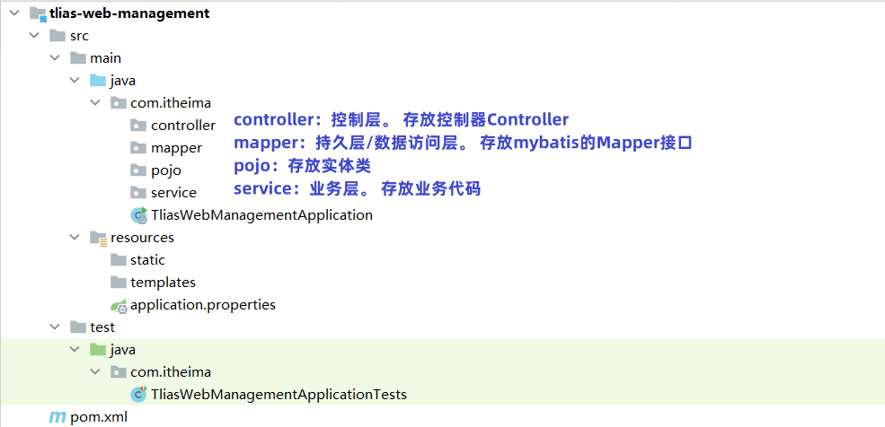
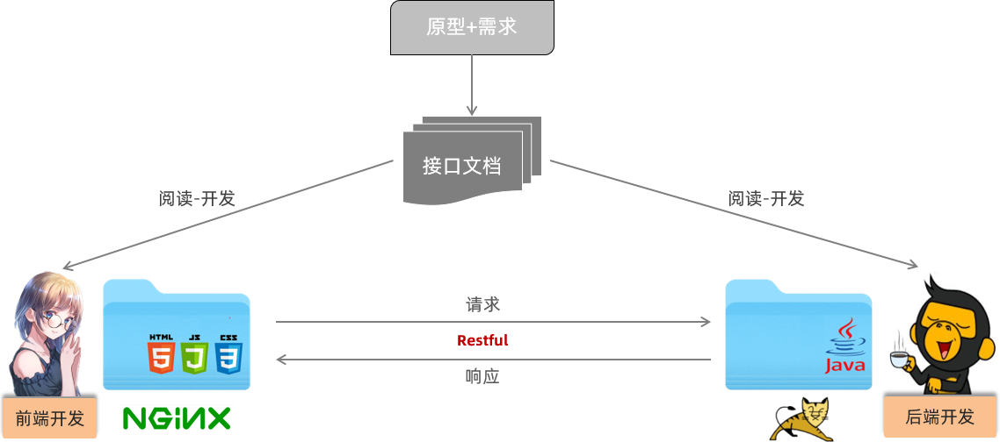
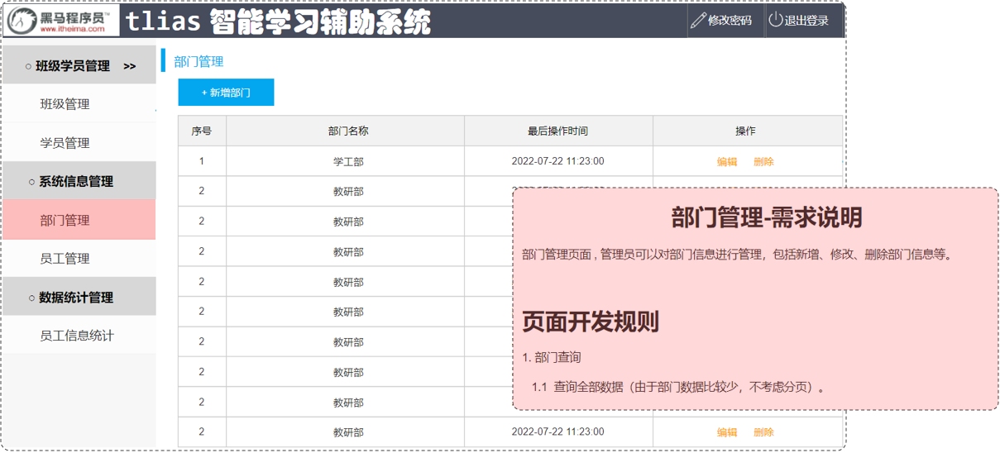
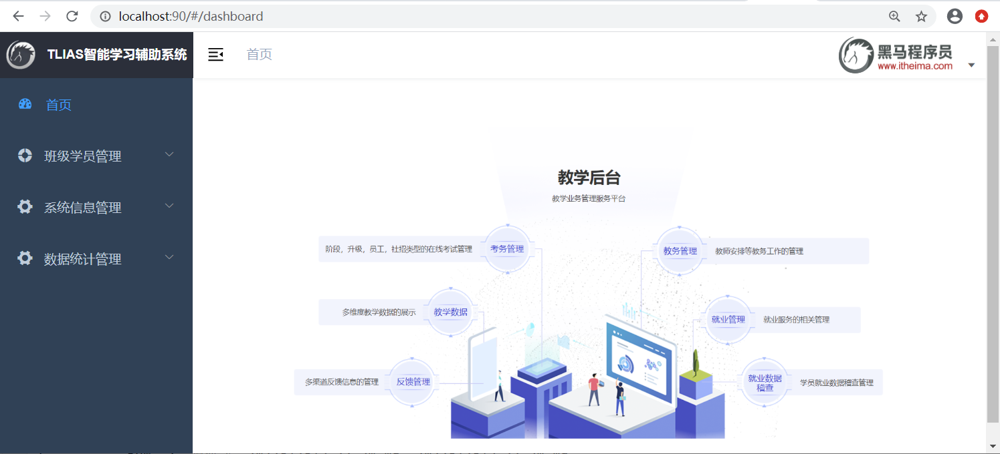
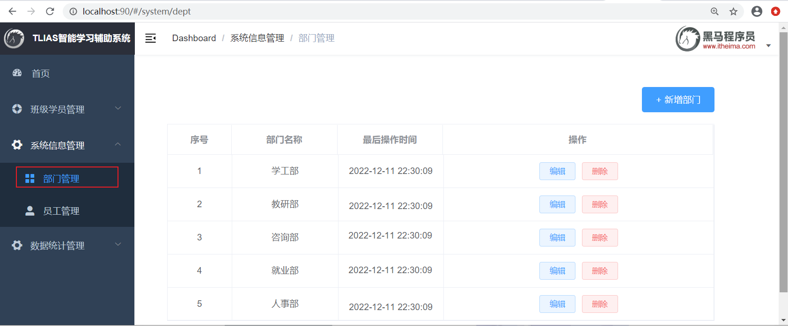
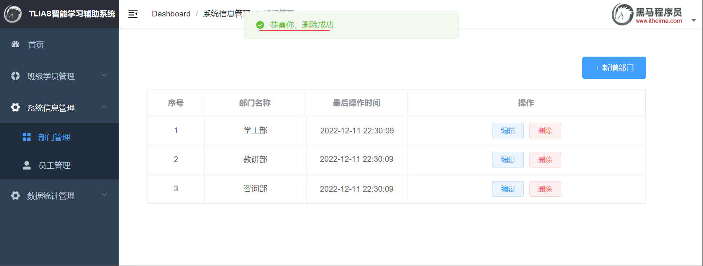

# SpringBootWeb案例

前面我们已经讲解了Web前端开发的基础知识，也讲解了Web后端开发的基础(HTTP协议、请求响应)，并且也讲解了数据库MySQL，以及通过Mybatis框架如何来完成数据库的基本操作。 那接下来，我们就通过一个案例，来将前端开发、后端开发、数据库整合起来。 而这个案例呢，就是我们前面提到的Tlias智能学习辅助系统。



在这个案例中，前端开发人员已经将前端工程开发完毕了。 我们需要做的，就是参考接口文档完成后端功能的开发，然后结合前端工程进行联调测试即可。


**完成后的成品效果展示：**


> **今天的主要内容如下：**
>
> - 准备工作
> - 部门管理
> - 员工管理


下面我们就进入到今天的第1个内容`准备工作`的学习。


## 1. 准备工作

准备工作的学习，我们先从"需求"和"环境搭建"开始入手。

### 1.1 需求&环境搭建

#### 1.1.1 需求说明

**1、部门管理**


部门管理功能开发包括：

- 查询部门列表
- 删除部门
- 新增部门
- 修改部门


**2、员工管理**


员工管理功能开发包括：

- 查询员工列表(分页、条件)
- 删除员工
- 新增员工
- 修改员工


#### 1.1.2 环境搭建


步骤：

1. 准备数据库表(dept、emp)
2. 创建springboot工程，引入对应的起步依赖（web、mybatis、mysql驱动、lombok）
3. 配置文件application.properties中引入mybatis的配置信息，准备对应的实体类
4. 准备对应的Mapper、Service(接口、实现类)、Controller基础结构


第1步：准备数据库表

~~~mysql
-- 部门管理
create table dept(
    id int unsigned primary key auto_increment comment '主键ID',
    name varchar(10) not null unique comment '部门名称',
    create_time datetime not null comment '创建时间',
    update_time datetime not null comment '修改时间'
) comment '部门表';
-- 部门表测试数据
insert into dept (id, name, create_time, update_time) values(1,'学工部',now(),now()),(2,'教研部',now(),now()),(3,'咨询部',now(),now()), (4,'就业部',now(),now()),(5,'人事部',now(),now());


-- 员工管理(带约束)
create table emp (
  id int unsigned primary key auto_increment comment 'ID',
  username varchar(20) not null unique comment '用户名',
  password varchar(32) default '123456' comment '密码',
  name varchar(10) not null comment '姓名',
  gender tinyint unsigned not null comment '性别, 说明: 1 男, 2 女',
  image varchar(300) comment '图像',
  job tinyint unsigned comment '职位, 说明: 1 班主任,2 讲师, 3 学工主管, 4 教研主管, 5 咨询师',
  entrydate date comment '入职时间',
  dept_id int unsigned comment '部门ID',
  create_time datetime not null comment '创建时间',
  update_time datetime not null comment '修改时间'
) comment '员工表';
-- 员工表测试数据
INSERT INTO emp
	(id, username, password, name, gender, image, job, entrydate,dept_id, create_time, update_time) VALUES
	(1,'jinyong','123456','金庸',1,'1.jpg',4,'2000-01-01',2,now(),now()),
	(2,'zhangwuji','123456','张无忌',1,'2.jpg',2,'2015-01-01',2,now(),now()),
	(3,'yangxiao','123456','杨逍',1,'3.jpg',2,'2008-05-01',2,now(),now()),
	(4,'weiyixiao','123456','韦一笑',1,'4.jpg',2,'2007-01-01',2,now(),now()),
	(5,'changyuchun','123456','常遇春',1,'5.jpg',2,'2012-12-05',2,now(),now()),
	(6,'xiaozhao','123456','小昭',2,'6.jpg',3,'2013-09-05',1,now(),now()),
	(7,'jixiaofu','123456','纪晓芙',2,'7.jpg',1,'2005-08-01',1,now(),now()),
	(8,'zhouzhiruo','123456','周芷若',2,'8.jpg',1,'2014-11-09',1,now(),now()),
	(9,'dingminjun','123456','丁敏君',2,'9.jpg',1,'2011-03-11',1,now(),now()),
	(10,'zhaomin','123456','赵敏',2,'10.jpg',1,'2013-09-05',1,now(),now()),
	(11,'luzhangke','123456','鹿杖客',1,'11.jpg',5,'2007-02-01',3,now(),now()),
	(12,'hebiweng','123456','鹤笔翁',1,'12.jpg',5,'2008-08-18',3,now(),now()),
	(13,'fangdongbai','123456','方东白',1,'13.jpg',5,'2012-11-01',3,now(),now()),
	(14,'zhangsanfeng','123456','张三丰',1,'14.jpg',2,'2002-08-01',2,now(),now()),
	(15,'yulianzhou','123456','俞莲舟',1,'15.jpg',2,'2011-05-01',2,now(),now()),
	(16,'songyuanqiao','123456','宋远桥',1,'16.jpg',2,'2007-01-01',2,now(),now()),
	(17,'chenyouliang','123456','陈友谅',1,'17.jpg',NULL,'2015-03-21',NULL,now(),now());
~~~


第2步：创建一个SpringBoot工程，选择引入对应的起步依赖（web、mybatis、mysql驱动、lombok） (版本选择2.7.5版本，可以创建完毕之后，在pom.xml文件中更改版本号)




 生成的pom.xml文件：

~~~xml
<?xml version="1.0" encoding="UTF-8"?>
<project xmlns="http://maven.apache.org/POM/4.0.0" xmlns:xsi="http://www.w3.org/2001/XMLSchema-instance"
         xsi:schemaLocation="http://maven.apache.org/POM/4.0.0 https://maven.apache.org/xsd/maven-4.0.0.xsd">
    <modelVersion>4.0.0</modelVersion>
    <parent>
        <groupId>org.springframework.boot</groupId>
        <artifactId>spring-boot-starter-parent</artifactId>
        <version>2.7.5</version>
        <relativePath/> 
    </parent>
    <groupId>com.itheima</groupId>
    <artifactId>tlias-web-management</artifactId>
    <version>0.0.1-SNAPSHOT</version>
    <name>tlias-web-management</name>
    <description>Demo project for Spring Boot</description>
    <properties>
        <java.version>11</java.version>
    </properties>
    <dependencies>
        <dependency>
            <groupId>org.springframework.boot</groupId>
            <artifactId>spring-boot-starter-web</artifactId>
        </dependency>
        <dependency>
            <groupId>org.mybatis.spring.boot</groupId>
            <artifactId>mybatis-spring-boot-starter</artifactId>
            <version>2.3.0</version>
        </dependency>

        <dependency>
            <groupId>com.mysql</groupId>
            <artifactId>mysql-connector-j</artifactId>
            <scope>runtime</scope>
        </dependency>
        <dependency>
            <groupId>org.projectlombok</groupId>
            <artifactId>lombok</artifactId>
            <optional>true</optional>
        </dependency>
        <dependency>
            <groupId>org.springframework.boot</groupId>
            <artifactId>spring-boot-starter-test</artifactId>
            <scope>test</scope>
        </dependency>
    </dependencies>

    <build>
        <plugins>
            <plugin>
                <groupId>org.springframework.boot</groupId>
                <artifactId>spring-boot-maven-plugin</artifactId>
                <configuration>
                    <excludes>
                        <exclude>
                            <groupId>org.projectlombok</groupId>
                            <artifactId>lombok</artifactId>
                        </exclude>
                    </excludes>
                </configuration>
            </plugin>
        </plugins>
    </build>

</project>
~~~

创建项目工程目录结构：




第3步：配置文件application.properties中引入mybatis的配置信息，准备对应的实体类

- application.properties （直接把之前项目中的复制过来）

~~~properties
#数据库连接
spring.datasource.driver-class-name=com.mysql.cj.jdbc.Driver
spring.datasource.url=jdbc:mysql://localhost:3306/tlias
spring.datasource.username=root
spring.datasource.password=1234

#开启mybatis的日志输出
mybatis.configuration.log-impl=org.apache.ibatis.logging.stdout.StdOutImpl

#开启数据库表字段 到 实体类属性的驼峰映射
mybatis.configuration.map-underscore-to-camel-case=true
~~~

- 实体类

~~~java
/*部门类*/
@Data
@NoArgsConstructor
@AllArgsConstructor
public class Dept {
    private Integer id;
    private String name;
    private LocalDateTime createTime;
    private LocalDateTime updateTime;
}
~~~

~~~java
/*员工类*/
@Data
@NoArgsConstructor
@AllArgsConstructor
public class Emp {
    private Integer id;
    private String username;
    private String password;
    private String name;
    private Short gender;
    private String image;
    private Short job;
    private LocalDate entrydate;
    private Integer deptId;
    private LocalDateTime createTime;
    private LocalDateTime updateTime;
}
~~~


第4步：准备对应的Mapper、Service(接口、实现类)、Controller基础结构

数据访问层：

- DeptMapper

~~~java
package com.itheima.mapper;
import org.apache.ibatis.annotations.Mapper;

@Mapper
public interface DeptMapper {
}
~~~

- EmpMapper

~~~java
package com.itheima.mapper;
import org.apache.ibatis.annotations.Mapper;

@Mapper
public interface EmpMapper {
}

~~~


业务层：

- DeptService

~~~java
package com.itheima.service;

//部门业务规则
public interface DeptService {
}
~~~

- DeptServiceImpl

~~~java
package com.itheima.service.impl;
import lombok.extern.slf4j.Slf4j;
import org.springframework.stereotype.Service;

//部门业务实现类
@Slf4j
@Service
public class DeptServiceImpl implements DeptService {
}
~~~

- EmpService

~~~java
package com.itheima.service;

//员工业务规则
public interface EmpService {
}
~~~

- EmpServiceImpl

~~~java
package com.itheima.service.impl;
import com.itheima.service.EmpService;
import lombok.extern.slf4j.Slf4j;
import org.springframework.stereotype.Service;

//员工业务实现类
@Slf4j
@Service
public class EmpServiceImpl implements EmpService {

}
~~~


控制层：

- DeptController

~~~java
package com.itheima.controller;
import org.springframework.web.bind.annotation.RestController;

//部门管理控制器
@RestController
public class DeptController {
}
~~~

- EmpController

~~~java
package com.itheima.controller;
import org.springframework.web.bind.annotation.RestController;

//员工管理控制器
@RestController
public class EmpController {
}
~~~

项目工程结构：


### 1.2 开发规范

了解完需求也完成了环境搭建了，我们下面开始学习开发的一些规范。

开发规范我们主要从以下几方面介绍：

**1、开发规范-REST**

我们的案例是基于当前最为主流的前后端分离模式进行开发。



在前后端分离的开发模式中，前后端开发人员都需要根据提前定义好的接口文档，来进行前后端功能的开发。

> 后端开发人员：必须严格遵守提供的接口文档进行后端功能开发（保障开发的功能可以和前端对接）
>
> 


而在前后端进行交互的时候，我们需要基于当前主流的REST风格的API接口进行交互。

什么是REST风格呢?

- REST（Representational State Transfer），表述性状态转换，它是一种软件架构风格。


**传统URL风格如下：**

```url
http://localhost:8080/user/getById?id=1     GET：查询id为1的用户
http://localhost:8080/user/saveUser         POST：新增用户
http://localhost:8080/user/updateUser       POST：修改用户
http://localhost:8080/user/deleteUser?id=1  GET：删除id为1的用户
```

我们看到，原始的传统URL呢，定义比较复杂，而且将资源的访问行为对外暴露出来了。


**基于REST风格URL如下：**

```
http://localhost:8080/users/1  GET：查询id为1的用户
http://localhost:8080/users    POST：新增用户
http://localhost:8080/users    PUT：修改用户
http://localhost:8080/users/1  DELETE：删除id为1的用户
```

其中总结起来，就一句话：通过URL定位要操作的资源，通过HTTP动词(请求方式)来描述具体的操作。


在REST风格的URL中，通过四种请求方式，来操作数据的增删改查。 

- GET ： 查询
- POST ：新增
- PUT ：修改
- DELETE ：删除

我们看到如果是基于REST风格，定义URL，URL将会更加简洁、更加规范、更加优雅。

> 注意事项：
>
> - REST是风格，是约定方式，约定不是规定，可以打破
> - 描述模块的功能通常使用复数，也就是加s的格式来描述，表示此类资源，而非单个资源。如：users、emps、books…


**2、开发规范-统一响应结果**

前后端工程在进行交互时，使用统一响应结果 Result。

~~~java
package com.itheima.pojo;

import lombok.AllArgsConstructor;
import lombok.Data;
import lombok.NoArgsConstructor;

@Data
@NoArgsConstructor
@AllArgsConstructor
public class Result {
    private Integer code;//响应码，1 代表成功; 0 代表失败
    private String msg;  //响应信息 描述字符串
    private Object data; //返回的数据

    //增删改 成功响应
    public static Result success(){
        return new Result(1,"success",null);
    }
    //查询 成功响应
    public static Result success(Object data){
        return new Result(1,"success",data);
    }
    //失败响应
    public static Result error(String msg){
        return new Result(0,msg,null);
    }
}
~~~


**3、开发流程**

我们在进行功能开发时，都是根据如下流程进行：

 

1. 查看页面原型明确需求
   - 根据页面原型和需求，进行表结构设计、编写接口文档(已提供)

2. 阅读接口文档
3. 思路分析
4. 功能接口开发
   - 就是开发后台的业务功能，一个业务功能，我们称为一个接口
5. 功能接口测试
   - 功能开发完毕后，先通过Postman进行功能接口测试，测试通过后，再和前端进行联调测试
6. 前后端联调测试
   - 和前端开发人员开发好的前端工程一起测试


## 2. 部门管理

我们按照前面学习的开发流程，开始完成功能开发。首先按照之前分析的需求，完成`部门管理`的功能开发。

开发的部门管理功能包含：

1. 查询部门
2. 删除部门
3. 新增部门
4. 更新部门（不讲解，自己独立完成）

### 2.1 查询部门

#### 2.1.1 原型和需求



> 查询的部门的信息：部门ID、部门名称、修改时间
>
> 通过页面原型以及需求描述，我们可以看到，部门查询，是不需要考虑分页操作的。


#### 2.1.2 接口文档

**部门列表查询**

- 基本信息

  ~~~
  请求路径：/depts
  
  请求方式：GET
  
  接口描述：该接口用于部门列表数据查询
  ~~~

- 请求参数

  无

- 响应数据

  参数格式：application/json

  参数说明：

  | 参数名         | 类型      | 是否必须 | 备注                           |
  | -------------- | --------- | -------- | ------------------------------ |
  | code           | number    | 必须     | 响应码，1 代表成功，0 代表失败 |
  | msg            | string    | 非必须   | 提示信息                       |
  | data           | object[ ] | 非必须   | 返回的数据                     |
  | \|- id         | number    | 非必须   | id                             |
  | \|- name       | string    | 非必须   | 部门名称                       |
  | \|- createTime | string    | 非必须   | 创建时间                       |
  | \|- updateTime | string    | 非必须   | 修改时间                       |

  响应数据样例：

  ~~~json
  {
    "code": 1,
    "msg": "success",
    "data": [
      {
        "id": 1,
        "name": "学工部",
        "createTime": "2022-09-01T23:06:29",
        "updateTime": "2022-09-01T23:06:29"
      },
      {
        "id": 2,
        "name": "教研部",
        "createTime": "2022-09-01T23:06:29",
        "updateTime": "2022-09-01T23:06:29"
      }
    ]
  }
  ~~~


#### 2.1.3 思路分析


#### 2.1.4 功能开发

通过查看接口文档：部门列表查询

> 请求路径：/depts
>
> 请求方式：GET
>
> 请求参数：无
>
> 响应数据：json格式

**DeptController**

```java
@Slf4j
@RestController
public class DeptController {
    @Autowired
    private DeptService deptService;

    //@RequestMapping(value = "/depts" , method = RequestMethod.GET)
    @GetMapping("/depts")
    public Result list(){
        log.info("查询所有部门数据");
        List<Dept> deptList = deptService.list();
        return Result.success(deptList);
    }
}
```

> @Slf4j注解源码：
>
> 

**DeptService**（业务接口）

```java
public interface DeptService {
    /**
     * 查询所有的部门数据
     * @return   存储Dept对象的集合
     */
    List<Dept> list();
}
```

 **DeptServiceImpl**（业务实现类）

```java
@Slf4j
@Service
public class DeptServiceImpl implements DeptService {
    @Autowired
    private DeptMapper deptMapper;
    
    @Override
    public List<Dept> list() {
        List<Dept> deptList = deptMapper.list();
        return deptList;
    }
}    
```

**DeptMapper**

```java
@Mapper
public interface DeptMapper {
    //查询所有部门数据
    @Select("select id, name, create_time, update_time from dept")
    List<Dept> list();
}
```


#### 2.1.5 功能测试

功能开发完成后，我们就可以启动项目，然后打开postman，发起GET请求，访问 ：http://localhost:8080/depts


### 2.2 前后端联调

完成了查询部门的功能，我们也通过postman工具测试通过了，下面我们再基于前后端分离的方式进行接口联调。具体操作如下：

1、将资料中提供的"前端环境"文件夹中的压缩包，拷贝到一个没有中文不带空格的目录下

 


2、拷贝到一个没有中文不带空格的目录后，进行解压（解压到当前目录）

 


3、启动nginx

 


4、打开浏览器，访问：http://localhost:90




5、测试：部门管理 - 查询部门列表



> 说明：只要按照接口文档开发功能接口，就能保证前后端程序交互
>
> - 后端：严格遵守接口文档进行功能接口开发
> - 前端：严格遵守接口文档访问功能接口


### 2.3 删除部门

查询部门的功能我们搞定了，下面我们开始完成`删除部门`的功能开发。

#### 2.3.1 需求


点击部门列表后面操作栏的 "删除" 按钮，就可以删除该部门信息。 此时，前端只需要给服务端传递一个ID参数就可以了。 我们从接口文档中也可以看得出来。


#### 2.3.2 接口文档

**删除部门**

- 基本信息

  ~~~
  请求路径：/depts/{id}
  
  请求方式：DELETE
  
  接口描述：该接口用于根据ID删除部门数据
  ~~~

- 请求参数
  参数格式：路径参数

  参数说明：

  | 参数名 | 类型   | 是否必须 | 备注   |
  | ------ | ------ | -------- | ------ |
  | id     | number | 必须     | 部门ID |

  请求参数样例：

  ~~~
  /depts/1
  ~~~

- 响应数据
  参数格式：application/json

  参数说明：

  | 参数名 | 类型   | 是否必须 | 备注                           |
  | ------ | ------ | -------- | ------------------------------ |
  | code   | number | 必须     | 响应码，1 代表成功，0 代表失败 |
  | msg    | string | 非必须   | 提示信息                       |
  | data   | object | 非必须   | 返回的数据                     |

  响应数据样例：

  ~~~json
  {
      "code":1,
      "msg":"success",
      "data":null
  }
  ~~~


#### 2.3.3 思路分析


> 接口文档规定：
>
> - 前端请求路径：/depts/{id}
> - 前端请求方式：DELETE
>
> 问题1：怎么在controller中接收请求路径中的路径参数？
>
> ~~~
> @PathVariable
> ~~~
>
> 问题2：如何限定请求方式是delete？
>
> ~~~
> @DeleteMapping
> ~~~


#### 2.3.4 功能开发

通过查看接口文档：删除部门

> 请求路径：/depts/{id}
>
> 请求方式：DELETE
>
> 请求参数：路径参数 {id}
>
> 响应数据：json格式

**DeptController**

~~~java
@Slf4j
@RestController
public class DeptController {
    @Autowired
    private DeptService deptService;

    @DeleteMapping("/depts/{id}")
    public Result delete(@PathVariable Integer id) {
        //日志记录
        log.info("根据id删除部门");
        //调用service层功能
        deptService.delete(id);
        //响应
        return Result.success();
    }
    
    //省略...
}
~~~

**DeptService**

~~~java
public interface DeptService {

    /**
     * 根据id删除部门
     * @param id    部门id
     */
    void delete(Integer id);

    //省略...
}
~~~

**DeptServiceImpl**

~~~java
@Slf4j
@Service
public class DeptServiceImpl implements DeptService {
    @Autowired
    private DeptMapper deptMapper;

    @Override
    public void delete(Integer id) {
        //调用持久层删除功能
        deptMapper.deleteById(id);
    }
    
    //省略...
}
~~~

**DeptMapper**

~~~java
@Mapper
public interface DeptMapper {
    /**
     * 根据id删除部门信息
     * @param id   部门id
     */
    @Delete("delete from dept where id = #{id}")
    void deleteById(Integer id);
   
    //省略...
}
~~~


#### 2.3.5 功能测试

删除功能开发完成后，重新启动项目，使用postman，发起DELETE请求：


#### 2.3.6 前后端联调

打开浏览器，测试后端功能接口：





### 2.4 新增部门

我们前面已完成了`查询部门`、`删除部门`两个功能，也熟悉了开发的流程。下面我们继续完成`新增部门`功能。

#### 2.4.1 需求


点击 "新增部门" 按钮，弹出新增部门对话框，输入部门名称，点击 "保存" ，将部门信息保存到数据库。
